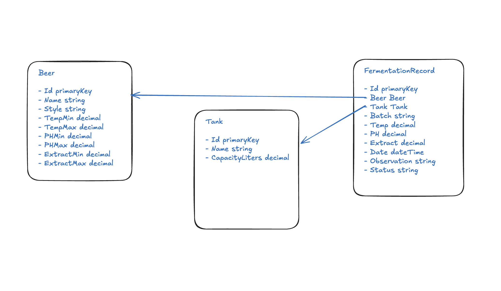

# Log de Decisões

## Modelagem inicial

Antes de começar a codar, optei por modelar as entidades e suas relações.
Entender as regras de negócio e como os dados se conectam primeiro me dá
clareza sobre o que precisa ser construído e evita retrabalho depois.

## Entidades e relações

- **Beer** — a cerveja cadastrada (nome e estilo). Carrega também seus
  parâmetros fermentativos aceitáveis (temperatura, pH e extrato — mínimo e
  máximo). Mantive esses parâmetros como colunas na própria tabela, já que são
  1:1 com a cerveja e sempre presentes.

- **Tank** — o tanque físico de fermentação (nome e capacidade em litros).
  É reutilizável: ao longo do tempo recebe vários lotes, de cervejas diferentes.

- **FermentationRecord** — cada apontamento fermentativo. Referencia uma
  **Beer** e um **Tank** (via FK + navigation property, resolvidas por convenção
  do EF), e guarda o número do lote, as leituras (temperatura, pH, extrato),
  data/hora, observações e o **status** da classificação.

Relações:

- Uma **Beer** tem vários **FermentationRecords** (1:N); um **Tank** também (1:N).
- Cada **FermentationRecord** pertence a uma Beer e a um Tank.
- O **lote** é um campo string (`BatchNumber`) no registro, não uma entidade
  própria — o desafio só o usa para agrupar o histórico. Modelar Lote como
  entidade fica como melhoria futura.

## Classificação

- **Critério**: cada parâmetro (temperatura, pH, extrato) é avaliado contra a
  faixa min/máx da cerveja. Dentro da faixa = Dentro do Padrão; fora da faixa
  mas dentro de uma tolerância = Atenção; além da tolerância = Fora do Padrão.
- **Tolerância = 5% da largura da faixa** (`(max - min) * 0.05`). Escolha
  documentada e ajustável. Alternativa considerada: margem absoluta fixa por
  parâmetro (faixas de pH são estreitas, então a % fica pequena).
- **Status geral = o pior dos três parâmetros**: um único parâmetro Fora do
  Padrão classifica o registro inteiro como Fora do Padrão.
- O resultado é gravado no campo `Status` do registro, alimentando os contadores
  do dashboard. **Reclassificação no update**: ao editar um registro, o Status é
  recalculado, já que os valores podem ter mudado.

## Camada de serviço

- **Input types separados dos DTOs** (`CreateBeerInput`, `UpdateBeerInput`):
  os DTOs ficam restritos à camada HTTP (controller); o service recebe um tipo
  próprio, mantendo-se independente do HTTP. Regra adotada: input types para
  entidades com muitos campos (Beer); Tank, por ter só 2 campos, segue com
  primitivos.
- **Validação de ranges** (min ≤ max para temp, pH e extrato): centralizada num
  método `Validate(beer)` compartilhado entre create e update, validando os
  valores finais da entidade (funciona para updates parciais).
- **Timestamps em UTC**: o Npgsql exige `DateTime` em UTC; uso
  `DateTime.SpecifyKind(..., Utc)` ao salvar.

## Tratamento de erros

- **Middleware global de exceções** (`IExceptionHandler`) mapeia
  `ArgumentException` → 400, usando o formato padrão `ProblemDetails` (RFC 7807).
  É o que trata as falhas de validação de range, mantendo os controllers limpos.

## Dashboard

- **Service dedicado** (`DashboardService`) em vez de acessar o DbContext direto
  no controller, mantendo a separação de camadas.
- **Query única agrupada** (`GroupBy` por Status) em vez de N contagens
  separadas — um round-trip ao banco.

## Testes

- **Escopo deliberado**: testes unitários apenas na regra de classificação
  (`ClassificationService`), que é lógica pura (sem dependências) e o núcleo do
  desafio. Cobrem cada categoria e os limites (exatamente no limite, dentro da
  tolerância, fora dela, e a regra do "pior parâmetro").
- **Sem mocks**: a regra de classificação não tem dependências a isolar. Testar
  services com DbContext exigiria banco em memória ou mock do EF — muito setup
  para pouco retorno neste escopo, então foi deixado de fora conscientemente.
- **Framework**: xUnit (padrão do ecossistema .NET).

## Versionamento de pacotes

- Pacotes do EF Core alinhados na versão 10.0.2 (ancorada pelo
  Npgsql.EntityFrameworkCore.PostgreSQL, que não possui 10.0.9), evitando
  conflitos de versão entre o projeto da API e o de testes.

## Seed de dados

- **Seeder no startup** (apenas em Development), com guard de idempotência
  (`if (await db.Beers.AnyAsync()) return;`) para não duplicar a cada restart.
- **Registros criados via FermentationService**, não inseridos direto no banco,
  para que a regra de classificação rode de verdade e os Status sejam reais.
- Dados baseados em perfis fermentativos realistas (IPA, Pilsner, Hefeweizen),
  com registros propositalmente cobrindo as três categorias de classificação.

## Frontend — decisões

- **Sem layout fixo no Figma**: o Figma fornece um design system (cores, fonte,
  ícones, logo), não telas prontas. Layout das telas definido por mim, aplicando
  os tokens da marca de forma consistente.
- **Tailwind v4 com tema em CSS** (`@theme` no index.css), não
  `tailwind.config.js`. As cores da paleta ArBrain viram tokens (`navy`,
  `brand`, `status-ok/attention/out`), gerando utilitários automaticamente.
  Reviewer não encontrará um config file — é intencional, é a abordagem da v4.
- **Cores de status mapeadas da paleta**: verde (#9CDA97) = Dentro do Padrão,
  amarelo (#FFC524) = Atenção, vermelho (#FA9897) = Fora do Padrão. A própria
  paleta do Figma já trazia essas três cores.
- **Ícones via lucide-react** em vez de extrair os ícones raster do Figma —
  mantém consistência visual sem depender de assets não exportados.
- **TanStack Query** para o estado de servidor (cache, loading/error,
  invalidação). Padrão em todas as telas: `useQuery` para leitura, `useMutation`
  - `invalidateQueries` para escrita. Escolhido em vez de fetch manual por dar
    cache e refetch automático sem boilerplate.
- **Camada de API tipada e isolada** (`api/`): funções de fetch puras, sem React,
  espelhando os DTOs do backend. Os hooks do Query as envolvem nos componentes —
  mesma separação de responsabilidades do backend (service/controller).
- **Invalidação cruzada de cache**: criar um registro invalida tanto `records`
  quanto `dashboard`, já que ambos dependem dos dados. Telas se atualizam sozinhas.
- **Componentes reutilizáveis** onde havia repetição: `StatusBadge` (usado em
  registros, histórico e dashboard) e helpers de formulário para campos numéricos.
- **Estado de formulário com objeto único** (Beer e Record, com muitos campos)
  em vez de múltiplos `useState`, com setter genérico tipado — mesma lógica do
  `BeerInput` no backend.
- **Escopo consciente**: cada entidade tem listagem + cadastro (as seis
  funcionalidades pedidas). Edição/exclusão e validação de formulário ficaram
  como melhorias, priorizando ter todas as telas funcionando dentro do prazo.
